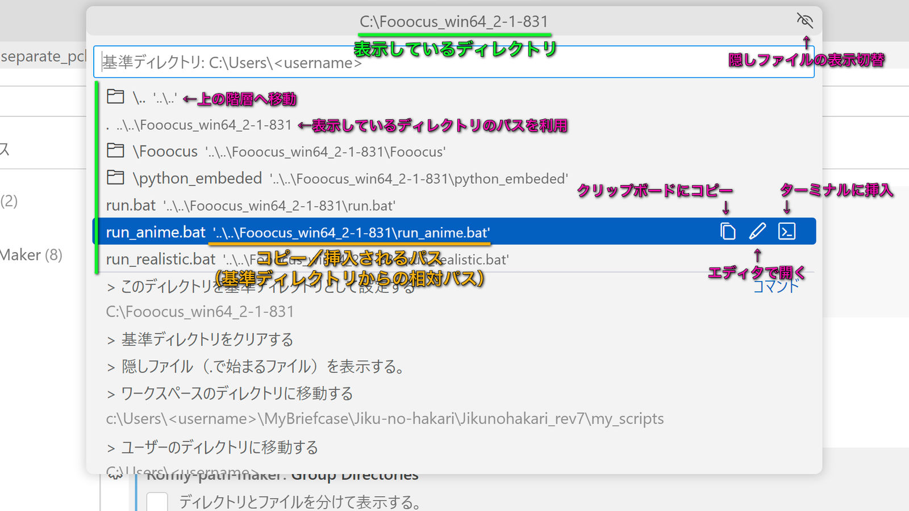
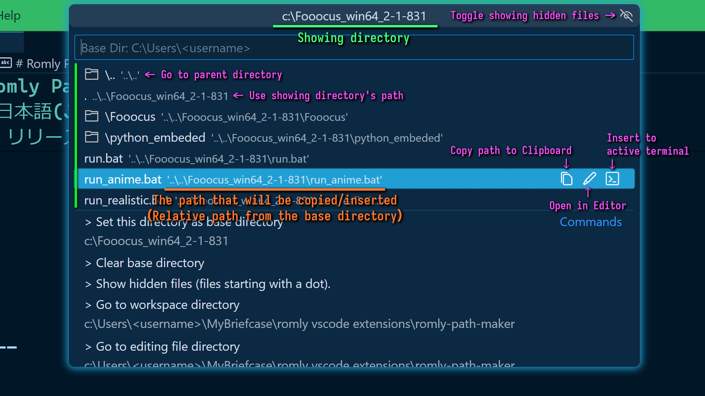

# Romly Path Maker

## 日本語(Japanese)

[English is here](#english英語)

コマンドパレット上でディレクトリを素早く探索し、選択したファイルのパスをアクティブなターミナルに入力したり、クリップボードにコピーできる拡張機能です。基準ディレクトリを設定しておき、相対パスを作ることもできます。

また、選択したファイルをエディタで開いたり、ディレクトリを開くこともできます。めちゃくちゃ簡易的なファイルブラウザのようなものです。

ターミナルでコマンドの引数にファイルパスを指定するのはよくあると思いますが、その時に手で入力したり、エクスプローラーからパスをコピーして持ってきたりするのが面倒なので、なんとか簡単に正確なパスを入力するツールを作れないものかと考えできあがったのがコレです。個人的にはそこそこ便利に使えています。

### 機能

- コマンドパレット上でディレクトリを辿り、
	- 選択したファイルをエディタで開く。
	- 選択したファイルのパスを、
		- クリップボードにコピーする。
		- アクティブなエディタに挿入する。
		- アクティブなターミナルに挿入する。
		- （基準ディレクトリを設定しておき、相対パスを得ることも可能）
	- ディレクトリをエクスプローラー／ファインダーで開く

#### パスを入力して移動

「パスを入力して移動」を選択すると、パスの直接入力モードとなり、設定されている基準ディレクトリと入力したパスで解決したディレクトリにあるファイル一覧を表示するようになります。求めているファイルやディレクトリがどこにあるかわかっているときに素早く指定できて便利です。

### 使い方

拡張機能をインストールしたのち、コマンドパレットから`Romly Path Maker`などと入力して呼び出して下さい。

### 拡張機能の設定

* `romly-path-maker.baseDirectory`: **設定する必要はありません。内部で使用されます。** 設定した基準ディレクトリが保存されます。この値が設定されていると、取得できるパスがこれを元にした相対パスになります。拡張機能呼び出し時に設定できるので、設定を直接変更する必要はありません。*ワークスペースのスコープ優先で読み書きされます。*

* `romly-path-maker.defaultAction`: ファイルを選択したときの処理を設定します。いずれかの操作を直接実行するか、メニューを表示するかを選択できます。

* `romly-path-maker.groupDirectories`: `true`の場合、ディレクトリとファイルを分け、ディレクトリをリストの先頭にまとめて表示します。これはリストの右上のボタンからも切り替えられます。

* `romly-path-maker.lastDirectory`: **設定する必要はありません。内部で使用されます。** 最後に表示したディレクトリのパスが保存され、`startDirectory` を `Last` にしたときに利用されます。ワークスペースのスコープ優先で書き込まれます。

* `romly-path-maker.showDirectoryIcons`: `true`にするとディレクトリにアイコンを表示するようになります。ファイルと判別しやすくなります。

* `romly-path-maker.showHiddenFiles`: `true`にすると隠しファイルを表示します。隠しファイルと言っても、ファイル名がドット(.)から始まるかチェックしてるだけで、ファイルの不可視属性を見てるわけではないです。コマンドパレット右上の目玉ボタンまたは該当コマンドを使っても切り替えられます。

* `romly-path-maker.startDirectory`: コマンドを呼び出したときに表示されるディレクトリです。ワークスペースのディレクトリ、編集中のファイルのディレクトリ、ユーザーのホームディレクトリのいずれかです。

* `romly-path-maker.showRelativeRoute`: `true`にすると基準ディレクトリ（絶対パスの場合はルートディレクトリ）からの経路の途中にあるディレクトリを表示します。

* `romly-path-maker.pathPresentation`: 各パスを基準ディレクトリからの相対パスで表示するか、絶対パスで表示するかの設定です。取得できるパスも表示に合わせて変化します。

* `romly-path-maker.itemButtonVisibility`: アイテムの右に表示されるボタンの表示／非表示を設定できます。表示したいボタンを追加して下さい。

### 既知の問題

MacとWindowsでしか動作確認していないので、Linux系OSだとちゃんと動かないかもしれません。

### リリースノート

[`CHANGELOG.md`](CHANGELOG.md)をご覧ください。

-----

## English(英語)

[日本語(Japanese)はこちら](#日本語japanese)

This extension allows you to quickly explore directories from the command palette, input the path of the selected file into the active terminal, or copy it to the clipboard. You can also set a base directory to create relative paths.

You can also open the selected file in the editor or open the directory. It's like super simple directory tree browser.

I assume it's common that you have to input file paths as command arguments in the terminal, but I felt manually typing them or copying paths from File Explorer can be cumbersome. I thought of creating a tool that can easily and accurately input paths, and that's how this was made. I find it useful so far, personally.

### Features

- Navigate through directories in the command palette,
	- Open the selected file in the editor.
	- About the path of the selected file able to,
		- Copy to the clipboard.
		- Insert into the active editor.
		- Insert into the active terminal.
		- (You can also get relative path by setting a base directory)
	- Open the directory in File Explorer/Finder.

### Go to input path

When you select "Go to input path", it activates the direct path input mode. This will display a list of files in the directory resolved by combining the set base directory with the path you input. It'd be convenient when you already know where the file or directory you're looking for is located, as it allows you to quickly specify the location.

### How to Use

After installing the extension, execute it by entering something like `Romly Path Maker` from the command palette.

### Extension Settings

* `romly-path-maker.baseDirectory`: **No need to set this. It is used internally.** The configured base directory is stored here. If this value is set, the obtained paths will be relative to this base directory. There is no need to change the setting directly because you can set this from the extension via the command palette. *It is read and written with workspace scope priority.*

* `romly-path-maker.defaultAction`: Sets the action when a file is selected. You can choose to either directly execute one of the actions or display a menu.

* `romly-path-maker.groupDirectories`: When set to `true`, it separates directories and files, displaying directories grouped together at the top of the list. This can also be toggled using the button at the top right of the list.

* `romly-path-maker.groupDirectories`: If set to `true`, directories and files are shown separately, with directories displayed at the top of the list.

* `romly-path-maker.lastDirectory`: **No need to set this. It is used internally.** The path of the last displayed directory is stored here, and it's used when `startDirectory` is set to `Last`. *It is read and written with workspace scope priority.*

* `romly-path-maker.showDirectoryIcons`: If set to `true`, folder icons are displayed for directories, making them easier to distinguish from files.

* `romly-path-maker.showHiddenFiles`: If set to `true`, hidden files are displayed. Note that it only checks if the filename starts with a dot (.), not looking at the file's actual hidden attribute. This setting can also be toggled with the eye button in the top right of the command palette or the corresponding command.

* `romly-path-maker.startDirectory`: The directory displayed first when the extension is invoked. The option include the workspace directory, the directory of the currently edited file, or the user's home directory.

* `romly-path-maker.showRelativeRoute`: When set to `true`, it displays the directories along the path from the base directory (or root directory in case of absolute path).

* `romly-path-maker.pathPresentation`: This setting determines whether to display each path as a relative path from the base directory or as an absolute path. The path you can retrieve will also change according to this setting.

* `romly-path-maker.itemButtonVisibility`: You can configure the visibility of buttons displayed to the right of each item. Add the buttons you want to display.

### Known Issues

It might not work properly on Linux-based OSs since I'm only using Mac and Windows.

### Release Notes

Please see [`CHANGELOG.md`](CHANGELOG.md) for details.

-----

Marketplace
